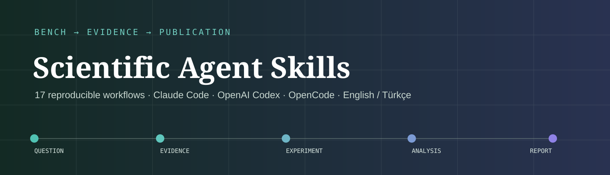

<a href="README.md">English</a> · <a href="https://yigityildiz0.github.io/scientific-agent-skills/">Searchable catalog</a> · <a href="INSTALL.md">Install guide</a> · <a href="THIRD_PARTY_NOTICES.md">Licenses</a>

# Bilimsel Agent Skill’leri

Bilimsel problem seçimi, literatür taraması, deney tasarımı, R/RStudio, biyostatistik, DESeq2, ggplot2, moleküler genetik, tek hücre analizi, scVI-tools, nf-core/Nextflow, Quarto ve akademik sunumlar için 17 odaklı Agent Skill.

Paketler taşınabilir `SKILL.md` biçimini kullanır. Claude Code, OpenAI Codex ve OpenCode ile biçim düzeyinde uyumludur; bilimsel yazılım, veri erişimi ve araçların çalışması kullanıcının ortamına bağlıdır. Bu ifade her bağımlılığın her platformda çalıştırıldığı anlamına gelmez.

Katalogdaki literatür tarama paketleri 2026-10-04 tarihinde güncellendi. Mevcut release paketleri eski sürümün anlık görüntüsüdür; bu güncelleme için katalogdaki tek-skill bağlantılarını kullanın. Claude.ai ve GPT eklenti paketlemesi kurulum rehberinde açıklanır.

## 17 skill’i toplu indir

[⬇ Claude Code](https://github.com/yigityildiz0/scientific-agent-skills/releases/latest/download/scientific-agent-skills-claude.zip) · [⬇ OpenAI Codex](https://github.com/yigityildiz0/scientific-agent-skills/releases/latest/download/scientific-agent-skills-codex.zip) · [⬇ OpenCode](https://github.com/yigityildiz0/scientific-agent-skills/releases/latest/download/scientific-agent-skills-opencode.zip)

Platformuna uygun paketi kullanıcı ana klasörüne veya proje köküne aç. Paket `.claude/skills`, `.agents/skills` ya da `.opencode/skills` yolunu hazır getirir. Yalnız ihtiyacın olan skill’leri yüklemek daha sağlıklıdır.

## Skill kataloğu

| Skill | Kategori | Ne yapar? | Platform notu | İndirme |
|---|---|---|---|---|
| [`academic-presentations`](skills/common/academic-presentations/SKILL.md) | Scientific communication | Tez, konferans ve bilimsel sunumları kanıt, argüman akışı, atıf ve erişilebilirlik kontrolleriyle planlar. | Ortak taşınabilir kaynak; üç host için biçim olarak hazır. Bağımlılıklar yerel doğrulama ister. | [⬇ Claude Code](https://github.com/yigityildiz0/scientific-agent-skills/raw/refs/heads/main/packages/common/academic-presentations.zip) · [⬇ OpenAI Codex](https://github.com/yigityildiz0/scientific-agent-skills/raw/refs/heads/main/packages/common/academic-presentations.zip) · [⬇ OpenCode](https://github.com/yigityildiz0/scientific-agent-skills/raw/refs/heads/main/packages/common/academic-presentations.zip) |
| [`bio-data-visualization-ggplot2-fundamentals`](skills/common/bio-data-visualization-ggplot2-fundamentals/SKILL.md) | R and biostatistics | R/ggplot2 ile renk görme farklılıklarına uygun, yayın kalitesinde figürler ve kontrollü vektör/raster çıktılar üretir. | Ortak taşınabilir kaynak; üç host için biçim olarak hazır. Bağımlılıklar yerel doğrulama ister. | [⬇ Claude Code](https://github.com/yigityildiz0/scientific-agent-skills/raw/refs/heads/main/packages/common/bio-data-visualization-ggplot2-fundamentals.zip) · [⬇ OpenAI Codex](https://github.com/yigityildiz0/scientific-agent-skills/raw/refs/heads/main/packages/common/bio-data-visualization-ggplot2-fundamentals.zip) · [⬇ OpenCode](https://github.com/yigityildiz0/scientific-agent-skills/raw/refs/heads/main/packages/common/bio-data-visualization-ggplot2-fundamentals.zip) |
| [`bio-differential-expression-deseq2-basics`](skills/common/bio-differential-expression-deseq2-basics/SKILL.md) | R and biostatistics | Bulk RNA-seq için açık kontrastlı DESeq2 modelleme, shrinkage, çoklu test kontrolü ve QC yürütür. | Ortak taşınabilir kaynak; üç host için biçim olarak hazır. Bağımlılıklar yerel doğrulama ister. | [⬇ Claude Code](https://github.com/yigityildiz0/scientific-agent-skills/raw/refs/heads/main/packages/common/bio-differential-expression-deseq2-basics.zip) · [⬇ OpenAI Codex](https://github.com/yigityildiz0/scientific-agent-skills/raw/refs/heads/main/packages/common/bio-differential-expression-deseq2-basics.zip) · [⬇ OpenCode](https://github.com/yigityildiz0/scientific-agent-skills/raw/refs/heads/main/packages/common/bio-differential-expression-deseq2-basics.zip) |
| [`experimental-design`](skills/common/experimental-design/SKILL.md) | Research strategy | Deneyleri deney birimi, kontrol, replikasyon, randomizasyon, bloklama ve DOE çevresinde planlar. | Ortak taşınabilir kaynak; üç host için biçim olarak hazır. Bağımlılıklar yerel doğrulama ister. | [⬇ Claude Code](https://github.com/yigityildiz0/scientific-agent-skills/raw/refs/heads/main/packages/common/experimental-design.zip) · [⬇ OpenAI Codex](https://github.com/yigityildiz0/scientific-agent-skills/raw/refs/heads/main/packages/common/experimental-design.zip) · [⬇ OpenCode](https://github.com/yigityildiz0/scientific-agent-skills/raw/refs/heads/main/packages/common/experimental-design.zip) |
| [`bioscience-research-router`](skills/common/bioscience-research-router/SKILL.md) | Routing and governance | Yaşam bilimi görevini en küçük yeterli akışa yönlendirir; kanıt, gizlilik, yeniden üretilebilirlik ve insan onayı sınırlarını uygular. | Ortak taşınabilir kaynak; üç host için biçim olarak hazır. Bağımlılıklar yerel doğrulama ister. | [⬇ Claude Code](https://github.com/yigityildiz0/scientific-agent-skills/raw/refs/heads/main/packages/common/bioscience-research-router.zip) · [⬇ OpenAI Codex](https://github.com/yigityildiz0/scientific-agent-skills/raw/refs/heads/main/packages/common/bioscience-research-router.zip) · [⬇ OpenCode](https://github.com/yigityildiz0/scientific-agent-skills/raw/refs/heads/main/packages/common/bioscience-research-router.zip) |
| [`knowledge-base`](skills/common/knowledge-base/SKILL.md) | Evidence and knowledge | İndeks, atomik not, bağlantı, kaynak izi ve bakım kontrolleriyle kalıcı bir Markdown araştırma bilgi tabanı kurar. | Ortak taşınabilir kaynak; üç host için biçim olarak hazır. Bağımlılıklar yerel doğrulama ister. | [⬇ Claude Code](https://github.com/yigityildiz0/scientific-agent-skills/raw/refs/heads/main/packages/common/knowledge-base.zip) · [⬇ OpenAI Codex](https://github.com/yigityildiz0/scientific-agent-skills/raw/refs/heads/main/packages/common/knowledge-base.zip) · [⬇ OpenCode](https://github.com/yigityildiz0/scientific-agent-skills/raw/refs/heads/main/packages/common/knowledge-base.zip) |
| [`molecular-genetics-assay-planning`](skills/common/molecular-genetics-assay-planning/SKILL.md) | Bioinformatics and omics | Araştırma amaçlı PCR, qPCR, primer ve prob tasarımını hedef kaynağı, özgüllük, termodinamik ve deneysel doğrulama kapılarıyla planlar. | Ortak taşınabilir kaynak; üç host için biçim olarak hazır. Bağımlılıklar yerel doğrulama ister. | [⬇ Claude Code](https://github.com/yigityildiz0/scientific-agent-skills/raw/refs/heads/main/packages/common/molecular-genetics-assay-planning.zip) · [⬇ OpenAI Codex](https://github.com/yigityildiz0/scientific-agent-skills/raw/refs/heads/main/packages/common/molecular-genetics-assay-planning.zip) · [⬇ OpenCode](https://github.com/yigityildiz0/scientific-agent-skills/raw/refs/heads/main/packages/common/molecular-genetics-assay-planning.zip) |
| [`nextflow-development`](skills/common/nextflow-development/SKILL.md) | Bioinformatics and omics | Yerel veya açık dizileme verisi için sabitlenmiş nf-core RNA-seq, Sarek ve ATAC-seq akışlarını planlar ve doğrular. | Ortak taşınabilir kaynak; üç host için biçim olarak hazır. Bağımlılıklar yerel doğrulama ister. | [⬇ Claude Code](https://github.com/yigityildiz0/scientific-agent-skills/raw/refs/heads/main/packages/common/nextflow-development.zip) · [⬇ OpenAI Codex](https://github.com/yigityildiz0/scientific-agent-skills/raw/refs/heads/main/packages/common/nextflow-development.zip) · [⬇ OpenCode](https://github.com/yigityildiz0/scientific-agent-skills/raw/refs/heads/main/packages/common/nextflow-development.zip) |
| [`quarto-authoring`](skills/common/quarto-authoring/SKILL.md) | Scientific communication | Atıf, çapraz referans, çalıştırılabilir kod ve yayın formatlarıyla Quarto belgeleri üretir ve dönüştürür. | Ortak taşınabilir kaynak; üç host için biçim olarak hazır. Bağımlılıklar yerel doğrulama ister. | [⬇ Claude Code](https://github.com/yigityildiz0/scientific-agent-skills/raw/refs/heads/main/packages/common/quarto-authoring.zip) · [⬇ OpenAI Codex](https://github.com/yigityildiz0/scientific-agent-skills/raw/refs/heads/main/packages/common/quarto-authoring.zip) · [⬇ OpenCode](https://github.com/yigityildiz0/scientific-agent-skills/raw/refs/heads/main/packages/common/quarto-authoring.zip) |
| [`r-bioscience-data-wrangling`](skills/common/r-bioscience-data-wrangling/SKILL.md) | R and biostatistics | Laboratuvar ve omik tablolarını kimlikleri bozmadan, satır anlamını sessizce değiştirmeden temizler, dönüştürür ve birleştirir. | Ortak taşınabilir kaynak; üç host için biçim olarak hazır. Bağımlılıklar yerel doğrulama ister. | [⬇ Claude Code](https://github.com/yigityildiz0/scientific-agent-skills/raw/refs/heads/main/packages/common/r-bioscience-data-wrangling.zip) · [⬇ OpenAI Codex](https://github.com/yigityildiz0/scientific-agent-skills/raw/refs/heads/main/packages/common/r-bioscience-data-wrangling.zip) · [⬇ OpenCode](https://github.com/yigityildiz0/scientific-agent-skills/raw/refs/heads/main/packages/common/r-bioscience-data-wrangling.zip) |
| [`r-biostatistics-workflow`](skills/common/r-biostatistics-workflow/SKILL.md) | R and biostatistics | Deney birimi ve estimand’dan başlayarak savunulabilir R modellerini seçer, teşhis eder, yorumlar ve raporlar. | Ortak taşınabilir kaynak; üç host için biçim olarak hazır. Bağımlılıklar yerel doğrulama ister. | [⬇ Claude Code](https://github.com/yigityildiz0/scientific-agent-skills/raw/refs/heads/main/packages/common/r-biostatistics-workflow.zip) · [⬇ OpenAI Codex](https://github.com/yigityildiz0/scientific-agent-skills/raw/refs/heads/main/packages/common/r-biostatistics-workflow.zip) · [⬇ OpenCode](https://github.com/yigityildiz0/scientific-agent-skills/raw/refs/heads/main/packages/common/r-biostatistics-workflow.zip) |
| [`research-synthesis`](skills/common/research-synthesis/SKILL.md) | Evidence and knowledge | Nitel gözlemleri izlenebilir temalara, çelişkilere, kanıt boşluklarına ve sonraki adım hipotezlerine dönüştürür. | Ortak taşınabilir kaynak; üç host için biçim olarak hazır. Bağımlılıklar yerel doğrulama ister. | [⬇ Claude Code](https://github.com/yigityildiz0/scientific-agent-skills/raw/refs/heads/main/packages/common/research-synthesis.zip) · [⬇ OpenAI Codex](https://github.com/yigityildiz0/scientific-agent-skills/raw/refs/heads/main/packages/common/research-synthesis.zip) · [⬇ OpenCode](https://github.com/yigityildiz0/scientific-agent-skills/raw/refs/heads/main/packages/common/research-synthesis.zip) |
| [`rstudio-reproducible-analysis`](skills/common/rstudio-reproducible-analysis/SKILL.md) | R and biostatistics | Ham veriyi ezmeden veya yöntemi sessizce değiştirmeden yeniden üretilebilir RStudio ve renv analizleri kurar. | Ortak taşınabilir kaynak; üç host için biçim olarak hazır. Bağımlılıklar yerel doğrulama ister. | [⬇ Claude Code](https://github.com/yigityildiz0/scientific-agent-skills/raw/refs/heads/main/packages/common/rstudio-reproducible-analysis.zip) · [⬇ OpenAI Codex](https://github.com/yigityildiz0/scientific-agent-skills/raw/refs/heads/main/packages/common/rstudio-reproducible-analysis.zip) · [⬇ OpenCode](https://github.com/yigityildiz0/scientific-agent-skills/raw/refs/heads/main/packages/common/rstudio-reproducible-analysis.zip) |
| [`scientific-literature-review`](skills/common/scientific-literature-review/SKILL.md) | Evidence and knowledge | Biyomedikal/klinik literatürü tekrarlanabilir sorgularla tarar; kaynak, çalışma tasarımı ve güncelleme sınırlarını koruyarak derleme taslakları üretir. | GPT/Codex ve Claude için ayrı paket; Claude açıklaması 200 karakter altında. Yapı doğrulandı; hesapta etkinleşme ve canlı erişim host'ta doğrulanmalı. | [⬇ Claude Code](https://github.com/yigityildiz0/scientific-agent-skills/raw/refs/heads/main/packages/claude/scientific-literature-review.zip) · [⬇ OpenAI Codex](https://github.com/yigityildiz0/scientific-agent-skills/raw/refs/heads/main/packages/codex/scientific-literature-review.zip) · [⬇ OpenCode](https://github.com/yigityildiz0/scientific-agent-skills/raw/refs/heads/main/packages/common/scientific-literature-review.zip) |
| [`scientific-problem-selection`](skills/common/scientific-problem-selection/SKILL.md) | Research strategy | Bilimsel fikir geliştirme, problem seçimi, risk değerlendirmesi ve stratejik proje kararlarını yapılandırır. | Ortak taşınabilir kaynak; üç host için biçim olarak hazır. Bağımlılıklar yerel doğrulama ister. | [⬇ Claude Code](https://github.com/yigityildiz0/scientific-agent-skills/raw/refs/heads/main/packages/common/scientific-problem-selection.zip) · [⬇ OpenAI Codex](https://github.com/yigityildiz0/scientific-agent-skills/raw/refs/heads/main/packages/common/scientific-problem-selection.zip) · [⬇ OpenCode](https://github.com/yigityildiz0/scientific-agent-skills/raw/refs/heads/main/packages/common/scientific-problem-selection.zip) |
| [`scvi-tools`](skills/common/scvi-tools/SKILL.md) | Bioinformatics and omics | Tek hücre entegrasyonu, multimodal analiz, referans eşleme ve velocity için scVI ailesindeki doğru modeli seçer ve yürütür. | Ortak taşınabilir kaynak; üç host için biçim olarak hazır. Bağımlılıklar yerel doğrulama ister. | [⬇ Claude Code](https://github.com/yigityildiz0/scientific-agent-skills/raw/refs/heads/main/packages/common/scvi-tools.zip) · [⬇ OpenAI Codex](https://github.com/yigityildiz0/scientific-agent-skills/raw/refs/heads/main/packages/common/scvi-tools.zip) · [⬇ OpenCode](https://github.com/yigityildiz0/scientific-agent-skills/raw/refs/heads/main/packages/common/scvi-tools.zip) |
| [`single-cell-rna-qc`](skills/common/single-cell-rna-qc/SKILL.md) | Bioinformatics and omics | H5AD veya 10x verisinde scverse/MAD tabanlı QC yapar ve gözden geçirilebilir filtrelenmiş çıktılar üretir. | Ortak taşınabilir kaynak; üç host için biçim olarak hazır. Bağımlılıklar yerel doğrulama ister. | [⬇ Claude Code](https://github.com/yigityildiz0/scientific-agent-skills/raw/refs/heads/main/packages/common/single-cell-rna-qc.zip) · [⬇ OpenAI Codex](https://github.com/yigityildiz0/scientific-agent-skills/raw/refs/heads/main/packages/common/single-cell-rna-qc.zip) · [⬇ OpenCode](https://github.com/yigityildiz0/scientific-agent-skills/raw/refs/heads/main/packages/common/single-cell-rna-qc.zip) |

## Başlangıç

1. [Aranabilir kataloğu](https://yigityildiz0.github.io/scientific-agent-skills/) aç veya yukarıdaki tabloyu kullan.
2. Tek skill ZIP’ini ya da platform paketini indir.
3. Araç izni vermeden veya bilimsel paket kurmadan önce skill içeriğini oku.
4. Doğal dille iste: `scientific-literature-review kullan; ... konusu için tekrar üretilebilir PubMed sorgusu ve kanıt tablosu hazırla.`

## Yeniden üretilebilirlik ve güvenlik

- Ham veriyi değiştirme; sürüm, parametre, seed, kimlik ve checksum kaydı tut.
- Kurulum, indirme, dış servis, yönetici değişikliği, silme ve yayınlama açık kullanıcı onayı ister.
- Klinik, biyogüvenlik, IRB/IBC/IACUC, GLP/GMP ve regülasyon kararları yetkin insan ve kurumlara aittir.
- Lisans ve kaynak durumu skill’e göre değişir. Yeniden dağıtmadan önce [THIRD_PARTY_NOTICES.md](THIRD_PARTY_NOTICES.md) dosyasını oku.

Ayrıntılar: [INSTALL.tr.md](INSTALL.tr.md), [SECURITY.md](SECURITY.md), [CONTRIBUTING.md](CONTRIBUTING.md).
