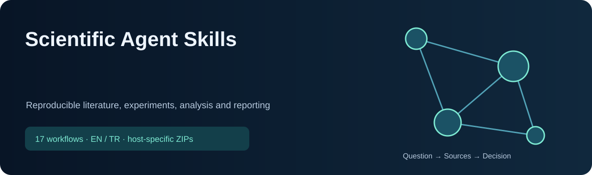

<!-- CURRENT-SKILL-PUBLICATION -->

# Scientific Agent Skills

17 skill: kaynak araştırma, araç seçimi ve doğrulanabilir sonuç üretme için hazır iş akışları. Modelin ağırlıklarını değiştirmez; sonuç kalitesi kullanılan kaynaklara ve araçlara bağlıdır.

 

**ChatGPT:** bütün listelenen skilleri içeren eklenti paketini indir; hesabının desteklediği kişisel eklenti/skill içe aktarma akışını kullan. Tek-skill ChatGPT bağlantısı, tek skill içeren eklenti ZIP’idir. **Claude:** toplu ZIP’i aç, içindeki tekil skill ZIP’lerini ayrı ayrı yükle. Dış ZIP tek bir Claude skill’i değildir. Yerel kurulum bulut hesabına yükleme yapmaz.

Türkçe veya İngilizce doğal isteklerle kullan; aşağıdaki örnekleri kendi soruna uyarla. Kısa kelimeler seçim ipuçlarıdır; bütün platformlarda aynı slash menüsünü oluşturmaz. Mevcut iş akışları ve güvenlik kuralları korunmuştur.

## Skill listesi

| Skill | Çözdüğü sorun / örnek istek | ChatGPT | Claude |
|---|---|---|---|
| [`academic-presentations`](skills/common/academic-presentations/SKILL.md) | Plan, write, review, or improve academic presentations for thesis defenses, conferences, seminars, lab meetings, grant briefings, and research talks. Use when evidence, argument flow, citations, methods, results, and scholarly presentation quality matter. | [↓ ZIP](packages/chatgpt/academic-presentations.zip) | [↓ ZIP](packages/claude/academic-presentations.zip) |
| [`bio-data-visualization-ggplot2-fundamentals`](skills/common/bio-data-visualization-ggplot2-fundamentals/SKILL.md) | Build publication-quality figures in R with ggplot2 using the grammar of graphics (data + aesthetics + geometries + scales + facets + themes) with CVD-safe palettes, cairo_pdf TrueType embedding, programmatic aes via tidy evaluation, and the theme_classic publication baseline. Use when producing static figures in R for papers, presentations, or reports. | [↓ ZIP](packages/chatgpt/bio-data-visualization-ggplot2-fundamentals.zip) | [↓ ZIP](packages/claude/bio-data-visualization-ggplot2-fundamentals.zip) |
| [`bio-differential-expression-deseq2-basics`](skills/common/bio-differential-expression-deseq2-basics/SKILL.md) | Performs differential expression on bulk RNA-seq count data with DESeq2's negative-binomial GLM, Wald and LRT testing, apeglm/ashr/normal LFC shrinkage, independent filtering, Cook's outlier handling, VST/rlog transforms, and design formulas including paired, batch, and interaction terms. Use when running bulk DE, choosing DESeq2 over edgeR or limma-voom, building a paired or interaction design, applying LFC shrinkage for ranking or GSEA, choosing Wald vs LRT, troubleshooting padj=NA, picking VST vs rlog, importing salmon/kallisto via tximport, or analyzing prokaryotic RNA-seq. | [↓ ZIP](packages/chatgpt/bio-differential-expression-deseq2-basics.zip) | [↓ ZIP](packages/claude/bio-differential-expression-deseq2-basics.zip) |
| [`bioscience-research-router`](skills/common/bioscience-research-router/SKILL.md) | Routes life-science work across scientific strategy, literature review, experimental design, molecular-genetics assay planning, RStudio reproducible analysis, R data wrangling, R biostatistics, bulk RNA-seq differential expression (DESeq2), ggplot2 figures, Quarto reporting, academic presentations, research synthesis, knowledge organization, single-cell QC, scvi-tools, and nf-core/Nextflow workflows. Use for wet-lab, molecular genetics, bioinformatics, omics, laboratory data, R or RStudio analysis, statistics and modeling, data cleaning and joins, publication figures, scientific report writing, thesis or conference talks, research planning, evidence synthesis, or U.S. research-compliance questions where reproducibility, provenance, privacy, biosafety, IRB/IBC, GLP, or GMP boundaries matter. | [↓ ZIP](packages/chatgpt/bioscience-research-router.zip) | [↓ ZIP](packages/claude/bioscience-research-router.zip) |
| [`experimental-design`](skills/common/experimental-design/SKILL.md) | Designs interpretable experiments before data collection by choosing the experimental unit, controls, replication, randomization, blocking, batch/run order, and factorial or response-surface structure. Use for wet-lab or omics study planning, plate/lane layouts, pseudoreplication checks, confounding prevention, DOE, crossover/repeated-measures/split-plot designs, or sample assignment. Pair with an appropriate statistical-power method and qualified human review for animal, human-subject, regulated, or high-impact studies. | [↓ ZIP](packages/chatgpt/experimental-design.zip) | [↓ ZIP](packages/claude/experimental-design.zip) |
| [`knowledge-base`](skills/common/knowledge-base/SKILL.md) | Create, organize, audit, or maintain a durable Markdown knowledge base with an index, atomic notes, stable identifiers, links, tags, and maintenance checks. Use for a personal or team knowledge base, research vault, documentation library, MOC, note organization, broken links, or knowledge-base cleanup; do not confuse it with short-term agent memory. | [↓ ZIP](packages/chatgpt/knowledge-base.zip) | [↓ ZIP](packages/claude/knowledge-base.zip) |
| [`molecular-genetics-assay-planning`](skills/common/molecular-genetics-assay-planning/SKILL.md) | Plans and validates research-use PCR, RT-PCR, qPCR, and probe assays with explicit target/isoform/reference-build provenance, primer3 candidate design, pair-aware genome/transcriptome specificity checks, thermodynamic screening, and empirical validation gates. Use for primer or probe design, qPCR assay planning, pseudogene/paralog/off-target checks, SNP-at-primer-site review, hairpin/dimer analysis, or troubleshooting assay specificity and efficiency. Not for autonomous clinical diagnostic claims or unreviewed wet-lab execution. | [↓ ZIP](packages/chatgpt/molecular-genetics-assay-planning.zip) | [↓ ZIP](packages/claude/molecular-genetics-assay-planning.zip) |
| [`nextflow-development`](skills/common/nextflow-development/SKILL.md) | Run nf-core bioinformatics pipelines (rnaseq, sarek, atacseq) on sequencing data. Use when analyzing RNA-seq, WGS/WES, or ATAC-seq data—either local FASTQs or public datasets from GEO/SRA. Triggers on nf-core, Nextflow, FASTQ analysis, variant calling, gene expression, differential expression, GEO reanalysis, GSE/GSM/SRR accessions, or samplesheet creation. | [↓ ZIP](packages/chatgpt/nextflow-development.zip) | [↓ ZIP](packages/claude/nextflow-development.zip) |
| [`quarto-authoring`](skills/common/quarto-authoring/SKILL.md) | Use when the user is explicitly working with Quarto, .qmd files, _quarto.yml, Quarto projects, or Quarto features such as callouts, cross-references, citations, Mermaid diagrams, extensions, websites, books, presentations, and reports. Also use for explicit migration from or comparison with R Markdown, bookdown, blogdown, xaringan, distill, or Jupyter notebooks to Quarto. Do not use for general R Markdown or related-format questions unless Quarto or migration to Quarto is explicitly mentioned. | [↓ ZIP](packages/chatgpt/quarto-authoring.zip) | [↓ ZIP](packages/claude/quarto-authoring.zip) |
| [`r-bioscience-data-wrangling`](skills/common/r-bioscience-data-wrangling/SKILL.md) | Clean, reshape, join, validate, and document laboratory, genetics, omics, sample-sheet, CSV, TSV, and spreadsheet data in R without corrupting identifiers or silently dropping observations. Use for dplyr, tidyr, readr, base-R data frames, missing values, duplicate sample IDs, long/wide conversion, joins, factor levels, dates, units, and auditable derived datasets. Preserve raw data and verify every row-count and key change. | [↓ ZIP](packages/chatgpt/r-bioscience-data-wrangling.zip) | [↓ ZIP](packages/claude/r-bioscience-data-wrangling.zip) |
| [`r-biostatistics-workflow`](skills/common/r-biostatistics-workflow/SKILL.md) | Plan, fit, diagnose, interpret, and report statistical analyses in R for laboratory, genetics, and bioscience data. Use when choosing among linear, generalized-linear, mixed-effects, paired, nonparametric, permutation, survival, repeated-measures, or multiple-testing workflows; when writing R model formulas and contrasts; or when checking assumptions, effect sizes, confidence intervals, missing data, batch effects, and pseudoreplication. Require a defensible study design before modeling. | [↓ ZIP](packages/chatgpt/r-biostatistics-workflow.zip) | [↓ ZIP](packages/claude/r-biostatistics-workflow.zip) |
| [`research-synthesis`](skills/common/research-synthesis/SKILL.md) | Synthesize qualitative research, feedback, interviews, observations, support tickets, or study notes into traceable themes, evidence, uncertainty, and actionable opportunities. Use for research synthesis, analyze interviews, synthesize user feedback, affinity mapping, insight report, or research findings. | [↓ ZIP](packages/chatgpt/research-synthesis.zip) | [↓ ZIP](packages/claude/research-synthesis.zip) |
| [`rstudio-reproducible-analysis`](skills/common/rstudio-reproducible-analysis/SKILL.md) | Use RStudio safely for reproducible scientific and genetics data analysis. Use when creating or repairing an RStudio Project, organizing R scripts and data, managing project-local packages with renv, debugging R code, recording provenance, or handing an analysis to a collaborator. Do not auto-install or update packages, overwrite raw data, save hidden workspace state, or change statistical methods without explicit evidence and validation. | [↓ ZIP](packages/chatgpt/rstudio-reproducible-analysis.zip) | [↓ ZIP](packages/claude/rstudio-reproducible-analysis.zip) |
| [`scientific-literature-review`](skills/common/scientific-literature-review/SKILL.md) | Builds biomedical literature searches, evidence maps and narrative/scoping/systematic-review drafts. Use for PubMed/MeSH, PICO, verified citations, research gaps and evidence updates. TR/EN: derleme hazırla, literatür/literatur derlemesi, literature review, scoping/systematic review. | [↓ ZIP](packages/chatgpt/scientific-literature-review.zip) | [↓ ZIP](packages/claude/scientific-literature-review.zip) |
| [`scientific-problem-selection`](skills/common/scientific-problem-selection/SKILL.md) | This skill should be used when scientists need help with research problem selection, project ideation, troubleshooting stuck projects, or strategic scientific decisions. Use this skill when users ask to pitch a new research idea, work through a project problem, evaluate project risks, plan research strategy, navigate decision trees, or get help choosing what scientific problem to work on. Typical requests include "I have an idea for a project", "I'm stuck on my research", "help me evaluate this project", "what should I work on", or "I need strategic advice about my research". | [↓ ZIP](packages/chatgpt/scientific-problem-selection.zip) | [↓ ZIP](packages/claude/scientific-problem-selection.zip) |
| [`scvi-tools`](skills/common/scvi-tools/SKILL.md) | Deep learning for single-cell analysis using scvi-tools. This skill should be used when users need (1) data integration and batch correction with scVI/scANVI, (2) ATAC-seq analysis with PeakVI, (3) CITE-seq multi-modal analysis with totalVI, (4) multiome RNA+ATAC analysis with MultiVI, (5) spatial transcriptomics deconvolution with DestVI, (6) label transfer and reference mapping with scANVI/scArches, (7) RNA velocity with veloVI, or (8) any deep learning-based single-cell method. Triggers include mentions of scVI, scANVI, totalVI, PeakVI, MultiVI, DestVI, veloVI, sysVI, scArches, variational autoencoder, VAE, batch correction, data integration, multi-modal, CITE-seq, multiome, reference mapping, latent space. | [↓ ZIP](packages/chatgpt/scvi-tools.zip) | [↓ ZIP](packages/claude/scvi-tools.zip) |
| [`single-cell-rna-qc`](skills/common/single-cell-rna-qc/SKILL.md) | Performs quality control on single-cell RNA-seq data (.h5ad or .h5 files) using scverse best practices with MAD-based filtering and comprehensive visualizations. Use when users request QC analysis, filtering low-quality cells, assessing data quality, or following scverse/scanpy best practices for single-cell analysis. | [↓ ZIP](packages/chatgpt/single-cell-rna-qc.zip) | [↓ ZIP](packages/claude/single-cell-rna-qc.zip) |

## Teknik bilgiler

Claude açıklamaları en fazla 200 karakterdir; her skill paketi en fazla 200 dosya içerir. Kaynaklar, yardımcı betikler ve lisanslar paketlenir. API anahtarları, ücretli erişim, yerel CLI ve canlı veri bağlantıları paketin parçası değildir. Kontroller paket yapısını ve kaynak eşleşmesini doğrular; hesapta yükleme, klinik doğruluk veya yatırım performansı testi yapıldığı anlamına gelmez. [Bütünlük değerleri](downloads/SHA256SUMS.txt) · [Kaynak ve lisans bilgisi](THIRD_PARTY_NOTICES.md).

<!-- END-CURRENT-SKILL-PUBLICATION -->

<a href="README.md">English</a> · <a href="https://yigityildiz0.github.io/scientific-agent-skills/">Searchable catalog</a> · <a href="INSTALL.md">Install guide</a> · <a href="THIRD_PARTY_NOTICES.md">Licenses</a>

# Bilimsel Agent Skill’leri

Bilimsel problem seçimi, literatür taraması, deney tasarımı, R/RStudio, biyostatistik, DESeq2, ggplot2, moleküler genetik, tek hücre analizi, scVI-tools, nf-core/Nextflow, Quarto ve akademik sunumlar için 17 odaklı Agent Skill.

Paketler taşınabilir `SKILL.md` biçimini kullanır. Claude Code, OpenAI Codex ve OpenCode ile biçim düzeyinde uyumludur; bilimsel yazılım, veri erişimi ve araçların çalışması kullanıcının ortamına bağlıdır. Bu ifade her bağımlılığın her platformda çalıştırıldığı anlamına gelmez.

Katalogdaki literatür tarama paketleri 2026-10-04 tarihinde güncellendi. Mevcut release paketleri eski sürümün anlık görüntüsüdür; bu güncelleme için katalogdaki tek-skill bağlantılarını kullanın. Claude.ai ve GPT eklenti paketlemesi kurulum rehberinde açıklanır.

## 17 skill’i toplu indir

[⬇ Claude Code](https://github.com/yigityildiz0/scientific-agent-skills/releases/latest/download/scientific-agent-skills-claude.zip) · [⬇ OpenAI Codex](https://github.com/yigityildiz0/scientific-agent-skills/releases/latest/download/scientific-agent-skills-codex.zip) · [⬇ OpenCode](https://github.com/yigityildiz0/scientific-agent-skills/releases/latest/download/scientific-agent-skills-opencode.zip)

Platformuna uygun paketi kullanıcı ana klasörüne veya proje köküne aç. Paket `.claude/skills`, `.agents/skills` ya da `.opencode/skills` yolunu hazır getirir. Yalnız ihtiyacın olan skill’leri yüklemek daha sağlıklıdır.

## Skill kataloğu

| Skill | Kategori | Ne yapar? | Platform notu | İndirme |
|---|---|---|---|---|
| [`academic-presentations`](skills/common/academic-presentations/SKILL.md) | Scientific communication | Tez, konferans ve bilimsel sunumları kanıt, argüman akışı, atıf ve erişilebilirlik kontrolleriyle planlar. | Ortak taşınabilir kaynak; üç host için biçim olarak hazır. Bağımlılıklar yerel doğrulama ister. | [⬇ Claude Code](https://github.com/yigityildiz0/scientific-agent-skills/raw/refs/heads/main/packages/common/academic-presentations.zip) · [⬇ OpenAI Codex](https://github.com/yigityildiz0/scientific-agent-skills/raw/refs/heads/main/packages/common/academic-presentations.zip) · [⬇ OpenCode](https://github.com/yigityildiz0/scientific-agent-skills/raw/refs/heads/main/packages/common/academic-presentations.zip) |
| [`bio-data-visualization-ggplot2-fundamentals`](skills/common/bio-data-visualization-ggplot2-fundamentals/SKILL.md) | R and biostatistics | R/ggplot2 ile renk görme farklılıklarına uygun, yayın kalitesinde figürler ve kontrollü vektör/raster çıktılar üretir. | Ortak taşınabilir kaynak; üç host için biçim olarak hazır. Bağımlılıklar yerel doğrulama ister. | [⬇ Claude Code](https://github.com/yigityildiz0/scientific-agent-skills/raw/refs/heads/main/packages/common/bio-data-visualization-ggplot2-fundamentals.zip) · [⬇ OpenAI Codex](https://github.com/yigityildiz0/scientific-agent-skills/raw/refs/heads/main/packages/common/bio-data-visualization-ggplot2-fundamentals.zip) · [⬇ OpenCode](https://github.com/yigityildiz0/scientific-agent-skills/raw/refs/heads/main/packages/common/bio-data-visualization-ggplot2-fundamentals.zip) |
| [`bio-differential-expression-deseq2-basics`](skills/common/bio-differential-expression-deseq2-basics/SKILL.md) | R and biostatistics | Bulk RNA-seq için açık kontrastlı DESeq2 modelleme, shrinkage, çoklu test kontrolü ve QC yürütür. | Ortak taşınabilir kaynak; üç host için biçim olarak hazır. Bağımlılıklar yerel doğrulama ister. | [⬇ Claude Code](https://github.com/yigityildiz0/scientific-agent-skills/raw/refs/heads/main/packages/common/bio-differential-expression-deseq2-basics.zip) · [⬇ OpenAI Codex](https://github.com/yigityildiz0/scientific-agent-skills/raw/refs/heads/main/packages/common/bio-differential-expression-deseq2-basics.zip) · [⬇ OpenCode](https://github.com/yigityildiz0/scientific-agent-skills/raw/refs/heads/main/packages/common/bio-differential-expression-deseq2-basics.zip) |
| [`experimental-design`](skills/common/experimental-design/SKILL.md) | Research strategy | Deneyleri deney birimi, kontrol, replikasyon, randomizasyon, bloklama ve DOE çevresinde planlar. | Ortak taşınabilir kaynak; üç host için biçim olarak hazır. Bağımlılıklar yerel doğrulama ister. | [⬇ Claude Code](https://github.com/yigityildiz0/scientific-agent-skills/raw/refs/heads/main/packages/common/experimental-design.zip) · [⬇ OpenAI Codex](https://github.com/yigityildiz0/scientific-agent-skills/raw/refs/heads/main/packages/common/experimental-design.zip) · [⬇ OpenCode](https://github.com/yigityildiz0/scientific-agent-skills/raw/refs/heads/main/packages/common/experimental-design.zip) |
| [`bioscience-research-router`](skills/common/bioscience-research-router/SKILL.md) | Routing and governance | Yaşam bilimi görevini en küçük yeterli akışa yönlendirir; kanıt, gizlilik, yeniden üretilebilirlik ve insan onayı sınırlarını uygular. | Ortak taşınabilir kaynak; üç host için biçim olarak hazır. Bağımlılıklar yerel doğrulama ister. | [⬇ Claude Code](https://github.com/yigityildiz0/scientific-agent-skills/raw/refs/heads/main/packages/common/bioscience-research-router.zip) · [⬇ OpenAI Codex](https://github.com/yigityildiz0/scientific-agent-skills/raw/refs/heads/main/packages/common/bioscience-research-router.zip) · [⬇ OpenCode](https://github.com/yigityildiz0/scientific-agent-skills/raw/refs/heads/main/packages/common/bioscience-research-router.zip) |
| [`knowledge-base`](skills/common/knowledge-base/SKILL.md) | Evidence and knowledge | İndeks, atomik not, bağlantı, kaynak izi ve bakım kontrolleriyle kalıcı bir Markdown araştırma bilgi tabanı kurar. | Ortak taşınabilir kaynak; üç host için biçim olarak hazır. Bağımlılıklar yerel doğrulama ister. | [⬇ Claude Code](https://github.com/yigityildiz0/scientific-agent-skills/raw/refs/heads/main/packages/common/knowledge-base.zip) · [⬇ OpenAI Codex](https://github.com/yigityildiz0/scientific-agent-skills/raw/refs/heads/main/packages/common/knowledge-base.zip) · [⬇ OpenCode](https://github.com/yigityildiz0/scientific-agent-skills/raw/refs/heads/main/packages/common/knowledge-base.zip) |
| [`molecular-genetics-assay-planning`](skills/common/molecular-genetics-assay-planning/SKILL.md) | Bioinformatics and omics | Araştırma amaçlı PCR, qPCR, primer ve prob tasarımını hedef kaynağı, özgüllük, termodinamik ve deneysel doğrulama kapılarıyla planlar. | Ortak taşınabilir kaynak; üç host için biçim olarak hazır. Bağımlılıklar yerel doğrulama ister. | [⬇ Claude Code](https://github.com/yigityildiz0/scientific-agent-skills/raw/refs/heads/main/packages/common/molecular-genetics-assay-planning.zip) · [⬇ OpenAI Codex](https://github.com/yigityildiz0/scientific-agent-skills/raw/refs/heads/main/packages/common/molecular-genetics-assay-planning.zip) · [⬇ OpenCode](https://github.com/yigityildiz0/scientific-agent-skills/raw/refs/heads/main/packages/common/molecular-genetics-assay-planning.zip) |
| [`nextflow-development`](skills/common/nextflow-development/SKILL.md) | Bioinformatics and omics | Yerel veya açık dizileme verisi için sabitlenmiş nf-core RNA-seq, Sarek ve ATAC-seq akışlarını planlar ve doğrular. | Ortak taşınabilir kaynak; üç host için biçim olarak hazır. Bağımlılıklar yerel doğrulama ister. | [⬇ Claude Code](https://github.com/yigityildiz0/scientific-agent-skills/raw/refs/heads/main/packages/common/nextflow-development.zip) · [⬇ OpenAI Codex](https://github.com/yigityildiz0/scientific-agent-skills/raw/refs/heads/main/packages/common/nextflow-development.zip) · [⬇ OpenCode](https://github.com/yigityildiz0/scientific-agent-skills/raw/refs/heads/main/packages/common/nextflow-development.zip) |
| [`quarto-authoring`](skills/common/quarto-authoring/SKILL.md) | Scientific communication | Atıf, çapraz referans, çalıştırılabilir kod ve yayın formatlarıyla Quarto belgeleri üretir ve dönüştürür. | Ortak taşınabilir kaynak; üç host için biçim olarak hazır. Bağımlılıklar yerel doğrulama ister. | [⬇ Claude Code](https://github.com/yigityildiz0/scientific-agent-skills/raw/refs/heads/main/packages/common/quarto-authoring.zip) · [⬇ OpenAI Codex](https://github.com/yigityildiz0/scientific-agent-skills/raw/refs/heads/main/packages/common/quarto-authoring.zip) · [⬇ OpenCode](https://github.com/yigityildiz0/scientific-agent-skills/raw/refs/heads/main/packages/common/quarto-authoring.zip) |
| [`r-bioscience-data-wrangling`](skills/common/r-bioscience-data-wrangling/SKILL.md) | R and biostatistics | Laboratuvar ve omik tablolarını kimlikleri bozmadan, satır anlamını sessizce değiştirmeden temizler, dönüştürür ve birleştirir. | Ortak taşınabilir kaynak; üç host için biçim olarak hazır. Bağımlılıklar yerel doğrulama ister. | [⬇ Claude Code](https://github.com/yigityildiz0/scientific-agent-skills/raw/refs/heads/main/packages/common/r-bioscience-data-wrangling.zip) · [⬇ OpenAI Codex](https://github.com/yigityildiz0/scientific-agent-skills/raw/refs/heads/main/packages/common/r-bioscience-data-wrangling.zip) · [⬇ OpenCode](https://github.com/yigityildiz0/scientific-agent-skills/raw/refs/heads/main/packages/common/r-bioscience-data-wrangling.zip) |
| [`r-biostatistics-workflow`](skills/common/r-biostatistics-workflow/SKILL.md) | R and biostatistics | Deney birimi ve estimand’dan başlayarak savunulabilir R modellerini seçer, teşhis eder, yorumlar ve raporlar. | Ortak taşınabilir kaynak; üç host için biçim olarak hazır. Bağımlılıklar yerel doğrulama ister. | [⬇ Claude Code](https://github.com/yigityildiz0/scientific-agent-skills/raw/refs/heads/main/packages/common/r-biostatistics-workflow.zip) · [⬇ OpenAI Codex](https://github.com/yigityildiz0/scientific-agent-skills/raw/refs/heads/main/packages/common/r-biostatistics-workflow.zip) · [⬇ OpenCode](https://github.com/yigityildiz0/scientific-agent-skills/raw/refs/heads/main/packages/common/r-biostatistics-workflow.zip) |
| [`research-synthesis`](skills/common/research-synthesis/SKILL.md) | Evidence and knowledge | Nitel gözlemleri izlenebilir temalara, çelişkilere, kanıt boşluklarına ve sonraki adım hipotezlerine dönüştürür. | Ortak taşınabilir kaynak; üç host için biçim olarak hazır. Bağımlılıklar yerel doğrulama ister. | [⬇ Claude Code](https://github.com/yigityildiz0/scientific-agent-skills/raw/refs/heads/main/packages/common/research-synthesis.zip) · [⬇ OpenAI Codex](https://github.com/yigityildiz0/scientific-agent-skills/raw/refs/heads/main/packages/common/research-synthesis.zip) · [⬇ OpenCode](https://github.com/yigityildiz0/scientific-agent-skills/raw/refs/heads/main/packages/common/research-synthesis.zip) |
| [`rstudio-reproducible-analysis`](skills/common/rstudio-reproducible-analysis/SKILL.md) | R and biostatistics | Ham veriyi ezmeden veya yöntemi sessizce değiştirmeden yeniden üretilebilir RStudio ve renv analizleri kurar. | Ortak taşınabilir kaynak; üç host için biçim olarak hazır. Bağımlılıklar yerel doğrulama ister. | [⬇ Claude Code](https://github.com/yigityildiz0/scientific-agent-skills/raw/refs/heads/main/packages/common/rstudio-reproducible-analysis.zip) · [⬇ OpenAI Codex](https://github.com/yigityildiz0/scientific-agent-skills/raw/refs/heads/main/packages/common/rstudio-reproducible-analysis.zip) · [⬇ OpenCode](https://github.com/yigityildiz0/scientific-agent-skills/raw/refs/heads/main/packages/common/rstudio-reproducible-analysis.zip) |
| [`scientific-literature-review`](skills/common/scientific-literature-review/SKILL.md) | Evidence and knowledge | Biyomedikal/klinik literatürü tekrarlanabilir sorgularla tarar; kaynak, çalışma tasarımı ve güncelleme sınırlarını koruyarak derleme taslakları üretir. | GPT/Codex ve Claude için ayrı paket; Claude açıklaması 200 karakter altında. Yapı doğrulandı; hesapta etkinleşme ve canlı erişim host'ta doğrulanmalı. | [⬇ Claude Code](https://github.com/yigityildiz0/scientific-agent-skills/raw/refs/heads/main/packages/claude/scientific-literature-review.zip) · [⬇ OpenAI Codex](https://github.com/yigityildiz0/scientific-agent-skills/raw/refs/heads/main/packages/codex/scientific-literature-review.zip) · [⬇ OpenCode](https://github.com/yigityildiz0/scientific-agent-skills/raw/refs/heads/main/packages/common/scientific-literature-review.zip) |
| [`scientific-problem-selection`](skills/common/scientific-problem-selection/SKILL.md) | Research strategy | Bilimsel fikir geliştirme, problem seçimi, risk değerlendirmesi ve stratejik proje kararlarını yapılandırır. | Ortak taşınabilir kaynak; üç host için biçim olarak hazır. Bağımlılıklar yerel doğrulama ister. | [⬇ Claude Code](https://github.com/yigityildiz0/scientific-agent-skills/raw/refs/heads/main/packages/common/scientific-problem-selection.zip) · [⬇ OpenAI Codex](https://github.com/yigityildiz0/scientific-agent-skills/raw/refs/heads/main/packages/common/scientific-problem-selection.zip) · [⬇ OpenCode](https://github.com/yigityildiz0/scientific-agent-skills/raw/refs/heads/main/packages/common/scientific-problem-selection.zip) |
| [`scvi-tools`](skills/common/scvi-tools/SKILL.md) | Bioinformatics and omics | Tek hücre entegrasyonu, multimodal analiz, referans eşleme ve velocity için scVI ailesindeki doğru modeli seçer ve yürütür. | Ortak taşınabilir kaynak; üç host için biçim olarak hazır. Bağımlılıklar yerel doğrulama ister. | [⬇ Claude Code](https://github.com/yigityildiz0/scientific-agent-skills/raw/refs/heads/main/packages/common/scvi-tools.zip) · [⬇ OpenAI Codex](https://github.com/yigityildiz0/scientific-agent-skills/raw/refs/heads/main/packages/common/scvi-tools.zip) · [⬇ OpenCode](https://github.com/yigityildiz0/scientific-agent-skills/raw/refs/heads/main/packages/common/scvi-tools.zip) |
| [`single-cell-rna-qc`](skills/common/single-cell-rna-qc/SKILL.md) | Bioinformatics and omics | H5AD veya 10x verisinde scverse/MAD tabanlı QC yapar ve gözden geçirilebilir filtrelenmiş çıktılar üretir. | Ortak taşınabilir kaynak; üç host için biçim olarak hazır. Bağımlılıklar yerel doğrulama ister. | [⬇ Claude Code](https://github.com/yigityildiz0/scientific-agent-skills/raw/refs/heads/main/packages/common/single-cell-rna-qc.zip) · [⬇ OpenAI Codex](https://github.com/yigityildiz0/scientific-agent-skills/raw/refs/heads/main/packages/common/single-cell-rna-qc.zip) · [⬇ OpenCode](https://github.com/yigityildiz0/scientific-agent-skills/raw/refs/heads/main/packages/common/single-cell-rna-qc.zip) |

## Başlangıç

1. [Aranabilir kataloğu](https://yigityildiz0.github.io/scientific-agent-skills/) aç veya yukarıdaki tabloyu kullan.
2. Tek skill ZIP’ini ya da platform paketini indir.
3. Araç izni vermeden veya bilimsel paket kurmadan önce skill içeriğini oku.
4. Doğal dille iste: `scientific-literature-review kullan; ... konusu için tekrar üretilebilir PubMed sorgusu ve kanıt tablosu hazırla.`

## Yeniden üretilebilirlik ve güvenlik

- Ham veriyi değiştirme; sürüm, parametre, seed, kimlik ve checksum kaydı tut.
- Kurulum, indirme, dış servis, yönetici değişikliği, silme ve yayınlama açık kullanıcı onayı ister.
- Klinik, biyogüvenlik, IRB/IBC/IACUC, GLP/GMP ve regülasyon kararları yetkin insan ve kurumlara aittir.
- Lisans ve kaynak durumu skill’e göre değişir. Yeniden dağıtmadan önce [THIRD_PARTY_NOTICES.md](THIRD_PARTY_NOTICES.md) dosyasını oku.

Ayrıntılar: [INSTALL.tr.md](INSTALL.tr.md), [SECURITY.md](SECURITY.md), [CONTRIBUTING.md](CONTRIBUTING.md).
